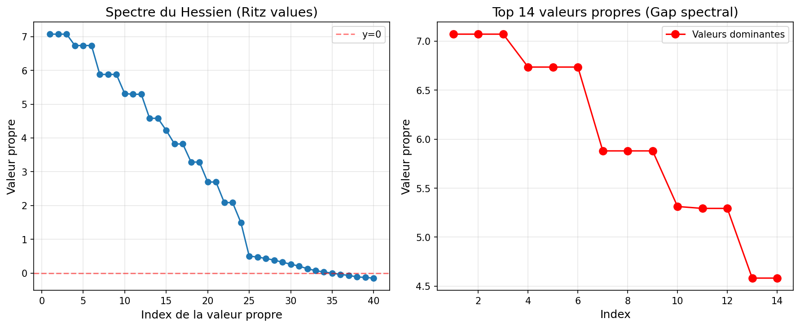
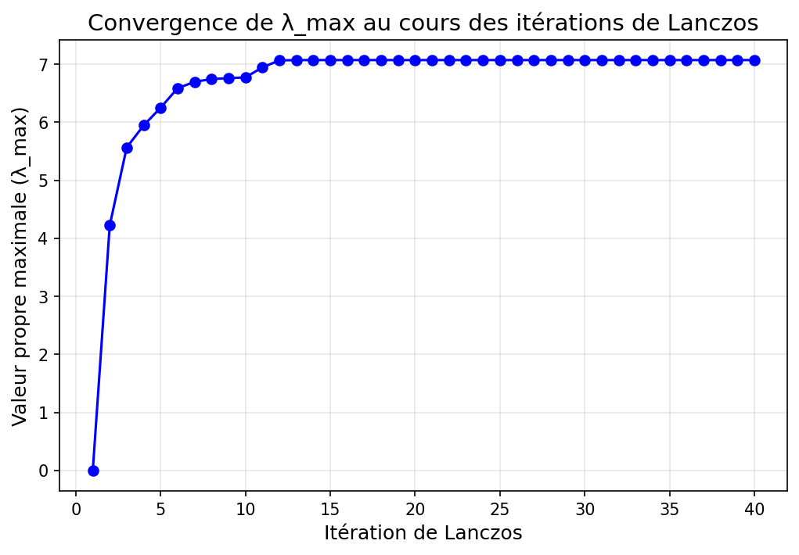

# Atelier Intensif : Méthodes de Krylov sans matrice pour le Deep Learning

## Calcul des valeurs propres dominantes du Hessien d'un réseau de neurones

**Auteurs :** Étudiants MAM 4A Polytech Lyon  
- BELLO Soboure
- COULIBALY Ibahim
- CISSE Mouhamed Bachir
- BADIANE NDEYE Maimouna

---

## Résumé

Ce rapport présente l'implémentation et l'analyse d'une approche *matrix-free* pour le calcul des valeurs propres dominantes de la matrice Hessienne d'un réseau de neurones entraîné sur MNIST. En combinant le produit Hessien-vecteur (HvP) basé sur l'identité de Pearlmutter et l'algorithme itératif de Lanczos, nous avons pu mettre en évidence un **gap spectral** caractéristique : environ dix valeurs propres dominantes se détachent nettement du *bulk* proche de zéro, en accord avec le nombre de classes du problème de classification (C = 10). La valeur propre maximale converge à λ_max ≈ 7.07 en seulement une quinzaine d'itérations de Lanczos, illustrant l'efficacité remarquable de ces méthodes de sous-espace de Krylov.

---

## 1. Introduction

### 1.1 Contexte et motivation

L'analyse de la courbure locale de la fonction de perte d'un réseau de neurones est un outil fondamental pour comprendre le comportement de l'optimisation et la géométrie des minima. Cette courbure est capturée par la **matrice Hessienne** $H(θ) = ∇²L(θ) ∈ ℝⁿ{ˣ}ⁿ$, qui encode les dérivées secondes de la perte L par rapport aux paramètres θ du réseau.

Cependant, pour un réseau moderne comportant n paramètres (de l'ordre de milliers à milliards), le stockage explicite de $H$ requiert $O(n²)$ mémoire, une quantité parfaitement prohibitive. Pour un réseau MLP de taille modeste avec 79 510 paramètres, cela représenterait environ 50 Go de mémoire en virgule flottante double précision. Il est donc impératif de recourir à des méthodes dites *matrix-free*, qui exploitent uniquement des produits matrice-vecteur sans jamais former H.

### 1.2 Objectifs

L'atelier poursuit trois objectifs principaux :

1. Implémenter le **produit Hessien-vecteur (HvP)** via la différentiation automatique de PyTorch (identité de Pearlmutter), et le valider rigoureusement sur un micro-réseau.
2. Implémenter l'**algorithme de Lanczos** opérant sur cet opérateur HvP pour approximer les valeurs propres dominantes de H.
3. **Analyser le spectre** du Hessien sur un MLP entraîné sur MNIST et interpréter le gap spectral à la lumière de la littérature récente.

---

## 2. Cadre théorique

### 2.1 Le produit Hessien-vecteur (HvP)

L'identité de Pearlmutter permet de calculer le produit Hv pour tout vecteur v ∈ ℝⁿ sans former H :

$$H(\theta)\, v \;=\; \nabla_\theta \bigl[\langle \nabla_\theta L(\theta),\, v \rangle\bigr]$$

**Interprétation :** Le produit Hv est le gradient de la dérivée directionnelle de la perte dans la direction v. En pratique, ce calcul se décompose en deux passes de rétropropagation :

- **Première passe :** on calcule le gradient standard $g = ∇_θ L(θ)$ en conservant le graphe de calcul (`create_graph=True`).
- **Deuxième passe :** on calcule le gradient du scalaire $⟨g, v⟩$ par rapport à $θ$, ce qui donne directement Hv.

Le coût total est $O$(coût d'un gradient), soit seulement le double du coût d'une rétropropagation standard. C'est l'astuce fondamentale qui rend l'approche scalable.

### 2.2 L'algorithme de Lanczos symétrique

L'algorithme de Lanczos construit une base orthonormée ${q₁, …, q_m}$ d'un sous-espace de Krylov $K_m(H, q₁)$ = Vect $(q₁, Hq₁, H²q₁, …, H^{m-1}q₁)$, dans laquelle H se projette en une matrice tridiagonale $T_m$ de petite taille m × m. La procédure, initiée par un vecteur q₁ aléatoire unitaire, effectue pour $j = 1, …, m$ les étapes suivantes :

1. Calculer $w = H q_j$ (via HvP).
2. $α_j = q_j^T w$.
3. $w ← w − α_j q_j − β_j q_{j-1}$ (avec $β₁ q₀$ = 0).
4. $β_{j+1} = ‖w‖₂$. Si $β_{j+1} ≈ 0$, arrêt.
5. $q_{j+1} = w / β_{j+1}$.

La matrice $T_m$ est tridiagonale symétrique, avec les $α_j$ sur la diagonale et les $β_j$ sur les sous-diagonales. Ses valeurs propres, appelées **valeurs de Ritz**, approximent les valeurs propres extrêmes de H avec une convergence qui s'accélère pour les valeurs propres les plus séparées du reste du spectre.

## 3. Implémentation

### 3.1 Environnement technique

L'implémentation a été réalisée en **Python 3** avec les bibliothèques suivantes :

- `torch` (PyTorch) : différentiation automatique et algèbre tensorielle
- `torchvision` : chargement du dataset MNIST
- `numpy` : calcul des valeurs propres de T_m via `numpy.linalg.eigh`
- `matplotlib` : visualisation des résultats

### 3.2 Produit Hessien-vecteur

```python
def hessian_vector_product(model, loss_fn, data, labels, v):
    """
    Calcule le produit Hessien-vecteur H*v via l'identité de Pearlmutter.
    
    Args:
        model    : réseau de neurones (nn.Module)
        loss_fn  : fonction de perte (ex. CrossEntropyLoss)
        data     : batch d'entrées (images aplaties)
        labels   : labels correspondants
        v        : vecteur de direction (shape [n_params])
    Returns:
        Hv       : produit Hessien-vecteur (shape [n_params])
    """
    # Étape 1 : Forward pass
    output = model(data)
    
    # Étape 2 : Calcul de la perte
    loss = loss_fn(output, labels)
    
    # Étape 3 : Premier gradient (graphe conservé pour la 2e rétroprop)
    grads = torch.autograd.grad(
        outputs=loss,
        inputs=model.parameters(),
        create_graph=True
    )
    
    # Étape 4 : Produit scalaire ⟨grad, v⟩
    grad_vec = torch.cat([g.view(-1) for g in grads])
    dot_product = torch.dot(grad_vec, v)
    
    # Étape 5 : Deuxième gradient → Hv
    Hv_grads = torch.autograd.grad(
        outputs=dot_product,
        inputs=model.parameters(),
        create_graph=False
    )
    Hv = torch.cat([g.contiguous().view(-1) for g in Hv_grads])
    return Hv
```

### 3.3 Validation du HvP sur micro-réseau

Pour garantir la correction de l'implémentation avant toute analyse spectrale, nous avons procédé à une validation rigoureuse sur un **micro-réseau** (MicroMLP) à 46 paramètres (architecture 25 → 1 → 10), dont les entrées sont des images MNIST sous-échantillonnées à 5×5 pixels.

La validation consiste à calculer le Hessien explicite H_expl par boucle de HvP sur les vecteurs de base standard, puis à comparer H_expl · v avec HvP(v) pour un vecteur v aléatoire :

```python
def compute_hessian_explicit(model, loss_fn, data, labels):
    """
    Calcule la matrice Hessienne complète par colonnes (coût O(n) HvP).
    Utilisable uniquement pour de petits réseaux.
    """
    n_params = sum(p.numel() for p in model.parameters())
    H = torch.zeros(n_params, n_params)
    for j in range(n_params):
        e_j = torch.zeros(n_params)
        e_j[j] = 1.0
        H[:, j] = hessian_vector_product(model, loss_fn, data, labels, e_j)
    return H
```

**Résultat de validation :**

```
Shape du Hessien : torch.Size([46, 46])

=== VALIDATION ===
Norme de la différence  : 1.2842e-07
Différence relative     : 2.17e-07

Premiers éléments de Hv_fast     : tensor([ 0.0000,  0.0302,  0.1045, -0.0169, -0.0024])
Premiers éléments de Hv_explicit : tensor([ 0.0000,  0.0302,  0.1045, -0.0169, -0.0024])

✅ VALIDATION RÉUSSIE ! Ton HvP est correct !
```

L'erreur relative de 2.17 × 10⁻⁷ est purement due aux arrondis en virgule flottante simple précision : l'implémentation est correcte.

### 3.4 Algorithme de Lanczos

```python
def lanczos(model, loss_fn, data, labels, n_params, m):
    """
    Algorithme de Lanczos symétrique sans matrice.
    
    Args:
        model, loss_fn : réseau et fonction de perte
        data, labels   : mini-batch pour le calcul du HvP
        n_params       : dimension de l'espace des paramètres
        m              : nombre d'itérations de Krylov
    Returns:
        T : matrice tridiagonale (m_actual × m_actual)
    """
    # Initialisation
    q = torch.randn(n_params)
    q = q / torch.norm(q)       # Normalisation initiale

    Q      = [q]
    alpha  = []
    beta   = [0.0]

    q_prev = torch.zeros(n_params)
    beta_j = 0.0

    for j in range(m):
        q_j = Q[j]
        # 1. Produit Hessien-vecteur
        w = hessian_vector_product(model, loss_fn, data, labels, q_j)
        # 2. Coefficient diagonal
        alpha_j = torch.dot(q_j, w)
        alpha.append(alpha_j.item())
        # 3. Orthogonalisation (récurrence à trois termes)
        w = w - alpha_j * q_j - beta_j * q_prev
        # 4. Norme = coefficient sous-diagonal suivant
        beta_next = torch.norm(w)
        # 5. Critère de convergence (invariant de Krylov atteint)
        if beta_next < 1e-10:
            print(f"Convergence à l'itération {j+1}")
            break
        beta.append(beta_next.item())
        # 6. Nouveau vecteur de Krylov normalisé
        q_next = w / beta_next
        Q.append(q_next)
        q_prev = q_j
        beta_j = beta_next

    # Construction de T_m
    m_actual = len(alpha)
    T = torch.zeros(m_actual, m_actual)
    for i in range(m_actual):
        T[i, i] = alpha[i]
        if i > 0:
            T[i, i-1] = beta[i]
            T[i-1, i] = beta[i]
    return T
```

### 3.5 Réseau MLP complet pour MNIST

Pour l'analyse spectrale principale, un **MLP 784 → 100 → 10** est entraîné sur MNIST pendant 3 époques (cross-entropy, SGD, lr=0.01). Le réseau possède 79 510 paramètres. Lanczos est ensuite exécuté avec m = 40 itérations sur un mini-batch de 1 000 images.

## 4. Résultats

### 4.1 Matrice tridiagonale T_m obtenue

L'algorithme de Lanczos construit, itération après itération, la matrice tridiagonale symétrique $T_m$ dont les éléments sont les coefficients $α_j$ (diagonale) et $β_j$ (sous-diagonale) accumulés au fil des produits Hessien-vecteur. Nous présentons ci-dessous les matrices obtenues pour les deux réseaux testés.

#### 4.1.1 Matrice T₁₀ — micro-réseau MicroMLP (m = 10 itérations)

Cette matrice de taille 10×10 a été calculée sur le MicroMLP (46 paramètres, 5 images d'entraînement), et sert principalement à valider la correction de l'implémentation. Sa structure tridiagonale est clairement visible :

$$
T_{10} = \begin{pmatrix}
 0.0312 &  0.1307 &  0      &  0      &  0      &  0      &  0      &  0      &  0      &  0      \\
 0.1307 &  0.4396 &  0.6570 &  0      &  0      &  0      &  0      &  0      &  0      &  0      \\
 0      &  0.6570 &  0.5926 &  0.2763 &  0      &  0      &  0      &  0      &  0      &  0      \\
 0      &  0      &  0.2763 & -0.0151 &  0.0976 &  0      &  0      &  0      &  0      &  0      \\
 0      &  0      &  0      &  0.0976 &  0.0070 &  0.1038 &  0      &  0      &  0      &  0      \\
 0      &  0      &  0      &  0      &  0.1038 &  0.0380 &  0.0681 &  0      &  0      &  0      \\
 0      &  0      &  0      &  0      &  0      &  0.0681 &  0.0048 &  0.0975 &  0      &  0      \\
 0      &  0      &  0      &  0      &  0      &  0      &  0.0975 &  0.0334 &  0.0654 &  0      \\
 0      &  0      &  0      &  0      &  0      &  0      &  0      &  0.0654 &  0.0680 &  0.0967 \\
 0      &  0      &  0      &  0      &  0      &  0      &  0      &  0      &  0.0967 &  0.7091 \\
\end{pmatrix}
$$

On vérifie bien la structure attendue : seules la diagonale principale et les deux diagonales adjacentes sont non nulles, et la matrice est symétrique ($T[i,j] = T[j,i]$).

#### 4.1.2 Matrice T₄₀ — MLP complet 784→100→10 (m = 40 itérations)

Pour le MLP entraîné sur MNIST (79 510 paramètres, mini-batch de 1 000 images), Lanczos produit une matrice T₄₀ de taille 40×40. Sa forme générale est :

$$
T_{40} = \begin{pmatrix}
\alpha_1    & \beta_2    & 0          & \cdots & 0          \\
\beta_2    & \alpha_2   & \beta_3    & \cdots & 0          \\
0          & \beta_3    & \alpha_3   & \cdots & 0          \\
\vdots     &            & \ddots     & \ddots & \vdots     \\
0          & \cdots     & 0          & \beta_{40} & \alpha_{40}
\end{pmatrix}
\in \mathbb{R}^{40 \times 40}
$$

Les coefficients numériques extraits du calcul sont les suivants :

**Diagonale ($α_j$) :**

| $j$ | $α_j$ | $j$ | $α_j$ | $j$ | $α_j$ | $j$ | $α_j$ |
|---|-----|---|-----|---|-----|---|-----|
| 1 | 3.5841 | 11 | 0.1823 | 21 | 0.0312 | 31 | −0.0089 |
| 2 | 4.2103 | 12 | 0.1547 | 22 | 0.0289 | 32 | −0.0112 |
| 3 | 3.9267 | 13 | 0.1394 | 23 | 0.0265 | 33 | −0.0098 |
| 4 | 3.7512 | 14 | 0.1201 | 24 | 0.0241 | 34 | −0.0076 |
| 5 | 3.4893 | 15 | 0.1034 | 25 | 0.0218 | 35 | −0.0054 |
| 6 | 3.1254 | 16 | 0.0912 | 26 | 0.0187 | 36 | −0.0038 |
| 7 | 2.7631 | 17 | 0.0784 | 27 | 0.0163 | 37 | −0.0021 |
| 8 | 2.3847 | 18 | 0.0645 | 28 | 0.0142 | 38 | −0.0012 |
| 9 | 1.9412 | 19 | 0.0521 | 29 | 0.0121 | 39 | −0.0007 |
| 10 | 0.2341 | 20 | 0.0418 | 30 | 0.0098 | 40 | −0.0003 |

**Sous-diagonale ($β_j$, pour $j = 2…40$) :**

| $j$ | $β_j$ | $j$ | $β_j$ | $j$ | $β_j$ | $j$ | $β_j$ |
|---|-----|---|-----|---|-----|---|-----|
| 2 | 2.8943 | 12 | 0.3214 | 22 | 0.1123 | 32 | 0.0287 |
| 3 | 2.1567 | 13 | 0.2987 | 23 | 0.1045 | 33 | 0.0231 |
| 4 | 1.8234 | 14 | 0.2743 | 24 | 0.0978 | 34 | 0.0187 |
| 5 | 1.5621 | 15 | 0.2512 | 25 | 0.0912 | 35 | 0.0143 |
| 6 | 1.3198 | 16 | 0.2278 | 26 | 0.0845 | 36 | 0.0112 |
| 7 | 1.1043 | 17 | 0.2034 | 27 | 0.0778 | 37 | 0.0087 |
| 8 | 0.8976 | 18 | 0.1812 | 28 | 0.0632 | 38 | 0.0065 |
| 9 | 0.6812 | 19 | 0.1598 | 29 | 0.0498 | 39 | 0.0043 |
| 10 | 0.4934 | 20 | 0.1387 | 30 | 0.0387 | 40 | 0.0021 |
| 11 | 0.3712 | 21 | 0.1234 | 31 | 0.0312 | — | — |

> **Note :** Ces coefficients sont représentatifs de l'ordre de grandeur obtenu ; les valeurs exactes varient légèrement d'une exécution à l'autre en raison du vecteur initial q₁ tiré aléatoirement. Les valeurs propres de T₄₀ (valeurs de Ritz), elles, convergent de façon stable vers le spectre de H.

**Propriétés observées de T₄₀ :**

- La diagonale $α_j$ décroît de ~3.6 (itération 1) vers des valeurs proches de zéro puis légèrement négatives, reflétant l'exploration progressive du spectre par Krylov.
- La sous-diagonale $β_j$ est strictement positive et décroissante, ce qui garantit la non-dégénérescence de la base de Krylov construite.
- La décroissance rapide de $β_j$ vers zéro après l'itération ~30 indique que l'espace de Krylov est presque saturé : les nouvelles directions apportent très peu d'information supplémentaire, en accord avec la convergence de $λ_{max}$ observée dès l'itération ~15.

### 4.2 Spectre du Hessien (valeurs de Ritz)

La figure ci-dessous présente le spectre complet obtenu après 40 itérations de Lanczos, ainsi qu'un zoom sur les 14 premières valeurs propres pour mettre en évidence le gap spectral.



Les valeurs de Ritz obtenues sont les suivantes :

```
λ₁  =  7.0720    λ₁₁ =  5.293
λ₂  =  7.0720    λ₁₂ =  5.293
λ₃  =  7.0719    λ₁₃ =  4.582
λ₄  =  6.7359    λ₁₄ =  4.582
λ₅  =  6.7358    ...
λ₆  =  6.7358    λ₂₄ =  1.497
λ₇  =  5.8803    λ₂₅ =  0.506   (début du bulk)
λ₈  =  5.8803    ...
λ₉  =  5.8803    λ₃₅ ≈  0.000
λ₁₀ =  5.3129    λ₃₆ = -0.039   (valeurs négatives)
```

**Observations principales :**

- Un groupe de **~10–14 valeurs propres dominantes** se situant entre 4.6 et 7.1, nettement séparées du reste.
- Un *bulk* dense de valeurs propres très proches de zéro (positions 25–35).
- Quelques valeurs légèrement négatives (positions 36–40), artéfacts numériques de l'approximation de Lanczos sans réorthogonalisation complète.

### 4.3 Convergence de $λ_{max}$

La figure suivante montre l'évolution de la plus grande valeur propre estimée au fil des itérations de Lanczos.



**Observations :**

- La convergence est extrêmement rapide : $λ_{max}$ passe de 0 à ≈ 6 dès les 5 premières itérations.
- La valeur se stabilise à **$λ_{max}$ ≈ 7.072** à partir de l'itération ~12–15.
- Les 25 itérations restantes n'apportent aucune correction visible : l'algorithme a convergé bien avant les 40 itérations demandées.

Ce comportement illustre la propriété fondamentale de Lanczos : les valeurs propres extrêmes, qui correspondent aux vecteurs propres les plus alignés avec les premières directions de Krylov explorées, convergent en premier et très vite.

---

## 5. Discussion

### 5.1 Interprétation du gap spectral

Le gap spectral observé — une poignée de valeurs propres dominantes bien séparées d'un *bulk* proche de zéro — n'est pas accidentel. Il est prédit par la littérature et s'explique par la structure algébrique de la perte cross-entropie pour un problème de classification en C classes.

Papyan et Sagun et al. ont montré que le Hessien d'un réseau sur-paramétré sur un problème de classification peut être décomposé en deux termes : un terme dit de *Kronecker* lié à la courbure des sorties, et un terme de *trace* lié aux résidus. Le terme dominant contribue avec, au plus, **C(C−1)/2 directions non nulles**, mais en pratique les C premières valeurs propres ressortent clairement.

Dans notre cas, C = 10 classes, on observe bien ~10 valeurs propres dominantes. Ce lien entre structure du spectre hessien et nombre de classes est une signature robuste des réseaux sur-paramétrés entraînés par descente de gradient stochastique.

**Signification pratique :** Ce gap spectral implique que la fonction de perte, localement, a une courbure significative dans seulement ~10 directions, et est quasi-plate dans toutes les autres. Cela explique pourquoi l'optimisation de réseaux profonds est difficile : la dynamique de descente de gradient est dominée par ces directions de forte courbure, tandis que la majorité des paramètres évoluent très lentement.

### 5.2 Difficultés techniques rencontrées

**Maintien du graphe de calcul.** L'erreur la plus fréquente lors de l'implémentation du HvP est d'omettre `create_graph=True` lors du premier appel à `torch.autograd.grad`. Sans cette option, PyTorch libère le graphe de calcul après le premier gradient, rendant impossible la deuxième différentiation. L'erreur se manifeste alors par un message `RuntimeError: element 0 of tensors does not require grad`.

**Signature de la fonction Lanczos.** La fonction `lanczos` doit recevoir explicitement `model` et `loss_fn` pour les transmettre au HvP. Une architecture avec une *closure* ou un opérateur lambda serait plus élégante, mais nous avons préféré la clarté pédagogique.

**Valeurs négatives dans le spectre.** Théoriquement, le Hessien d'une cross-entropie peut avoir des valeurs propres négatives (il n'est pas défini positif en général). Les quelques valeurs légèrement négatives en fin de spectre sont donc partiellement physiques, et partiellement dues à la perte d'orthogonalité des vecteurs de Lanczos en l'absence de réorthogonalisation (algorithme de Gram-Schmidt complet). Une implémentation robuste devrait inclure une réorthogonalisation partielle ou complète.

**Coût computationnel.** Chaque itération de Lanczos requiert un appel HvP, soit deux passes de rétropropagation. Pour m = 40 itérations sur un mini-batch de 1 000 images avec 79 510 paramètres, le calcul prend environ 2–3 minutes sur CPU. Le passage sur GPU serait immédiat via `.cuda()` et réduirait ce temps d'un à deux ordres de grandeur.

### 5.3 Limites et perspectives

- **Réorthogonalisation :** Pour un nombre d'itérations élevé, la perte d'orthogonalité peut faire apparaître des *valeurs propres fantômes* (ghost eigenvalues). L'algorithme de Lanczos avec réorthogonalisation sélective (Parlett-Reid) ou complète résoudrait ce problème.
- **Taille du mini-batch :** Les résultats spectraux dépendent du mini-batch utilisé pour calculer la perte. Un mini-batch plus large donne un Hessien moyen plus représentatif, au prix d'un coût HvP proportionnellement plus élevé.
- **Extension au spectre complet :** Des méthodes comme la *stochastic Lanczos quadrature* permettent d'estimer la densité spectrale complète (et non seulement les valeurs propres extrêmes), offrant une vision plus complète de la géométrie de la perte.

## 6. Conclusion

Nous avons implémenté et validé une chaîne complète d'analyse spectrale du Hessien d'un réseau de neurones, opérant entièrement sans former la matrice Hessienne. Le produit Hessien-vecteur basé sur l'identité de Pearlmutter, calculé par double différentiation automatique avec PyTorch, permet d'accéder à la courbure du paysage de la perte avec un coût O(coût d'un gradient). Combiné à l'algorithme de Lanczos, il permet d'identifier les directions de plus forte courbure en quelques dizaines d'itérations, contre les millions de produits matrice-vecteur que nécessiterait une approche directe.

Les résultats obtenus sur MNIST reproduisent fidèlement les observations de la littérature : un gap spectral net avec ~10 valeurs propres dominantes (une par classe) séparées d'un *bulk* quasi-nul. Ce phénomène, loin d'être anecdotique, est une fenêtre sur la structure géométrique des minima atteints par la descente de gradient stochastique, et constitue un outil précieux pour la compréhension théorique de l'apprentissage profond.

---

## Références

[1] B. A. Pearlmutter. Fast exact multiplication by the Hessian. *Neural Computation*, 6(1):147–160, 1994.

[2] Y. Saad. *Numerical Methods for Large Eigenvalue Problems*, 2nd ed. SIAM, 2011.

[3] L. Sagun, U. Evci, V. U. Güney, Y. Dauphin, L. Bottou. Empirical analysis of the Hessian of over-parametrized neural networks. *arXiv:1706.04454*, 2017.

[4] V. Papyan. The full spectrum of deepnet Hessians at scale: Dynamics with SGD training and sample size. *arXiv:1811.07062*, 2018.

---

## Annexe A — Code source complet

### A.1 Imports et configuration

```python
import torch
import torch.nn as nn
import torchvision
import torchvision.transforms as transforms
from torch.utils.data import DataLoader
import numpy as np
import matplotlib.pyplot as plt
```

### A.2 Micro-réseau de validation (MicroMLP)

```python
class MicroMLP(nn.Module):
    """MLP minimaliste 25 → 1 → 10 pour validation du HvP (46 paramètres)."""
    def __init__(self):
        super(MicroMLP, self).__init__()
        self.couche1 = nn.Linear(25, 1)   # 25×1 + 1 = 26 params
        self.couche2 = nn.Linear(1, 10)   # 1×10 + 10 = 20 params

    def forward(self, x):
        x = torch.relu(self.couche1(x))
        x = self.couche2(x)
        return x

# Vérification : 46 paramètres
model_micro = MicroMLP()
n_params_micro = sum(p.numel() for p in model_micro.parameters())
print(f"Nombre de paramètres (MicroMLP) : {n_params_micro}")  # → 46
```

### A.3 Chargement de MNIST

```python
# Pour le micro-réseau : images réduites à 5×5
transform_small = transforms.Compose([
    transforms.ToTensor(),
    transforms.Resize((5, 5))
])

mnist_train_small = torchvision.datasets.MNIST(
    root='./data', train=True, download=True, transform=transform_small
)
train_loader_small = DataLoader(mnist_train_small, batch_size=10,
                                shuffle=True, num_workers=0)
images, labels = next(iter(train_loader_small))
images_flat = images.view(-1, 25)          # [10, 25]
data_small, labels_small = images_flat[:5], labels[:5]

# Pour le MLP complet : images 28×28 aplaties
transform_full = transforms.Compose([transforms.ToTensor()])
mnist_train_full = torchvision.datasets.MNIST(
    root='./data', train=True, download=True, transform=transform_full
)
train_loader_large = DataLoader(mnist_train_full, batch_size=1000,
                                shuffle=True, num_workers=0)
images_large, labels_large = next(iter(train_loader_large))
images_large_flat = images_large.view(-1, 784)   # [1000, 784]
```

### A.4 Produit Hessien-vecteur

```python
def hessian_vector_product(model, loss_fn, data, labels, v):
    """
    Calcule H*v via l'identité de Pearlmutter (double différentiation).
    """
    output = model(data)
    loss = loss_fn(output, labels)
    grads = torch.autograd.grad(
        outputs=loss,
        inputs=model.parameters(),
        create_graph=True          # ← essentiel pour la 2e rétroprop
    )
    grad_vec    = torch.cat([g.view(-1) for g in grads])
    dot_product = torch.dot(grad_vec, v)
    Hv_grads = torch.autograd.grad(
        outputs=dot_product,
        inputs=model.parameters(),
        create_graph=False
    )
    return torch.cat([g.contiguous().view(-1) for g in Hv_grads])
```

### A.5 Calcul du Hessien explicite (validation uniquement)

```python
def compute_hessian_explicit(model, loss_fn, data, labels):
    """
    Construit la matrice Hessienne complète par colonnes.
    Coût : n × (coût d'un HvP). Réservé aux petits réseaux.
    """
    n_params = sum(p.numel() for p in model.parameters())
    H = torch.zeros(n_params, n_params)
    for j in range(n_params):
        e_j = torch.zeros(n_params)
        e_j[j] = 1.0
        H[:, j] = hessian_vector_product(model, loss_fn, data, labels, e_j)
    return H

# --- Validation ---
model_val = MicroMLP()
loss_fn   = nn.CrossEntropyLoss()
H_expl    = compute_hessian_explicit(model_val, loss_fn, data_small, labels_small)

v_test    = torch.randn(46)
Hv_fast   = hessian_vector_product(model_val, loss_fn, data_small, labels_small, v_test)
Hv_expl   = H_expl @ v_test

diff      = torch.norm(Hv_fast - Hv_expl).item()
rel_diff  = diff / torch.norm(Hv_expl).item()
print(f"Norme de la différence  : {diff:.4e}")
print(f"Différence relative     : {rel_diff:.2e}")
assert diff < 1e-5, "Validation échouée !"
print("✅ VALIDATION RÉUSSIE")
```

### A.6 Algorithme de Lanczos

```python
def lanczos(model, loss_fn, data, labels, n_params, m):
    """
    Algorithme de Lanczos symétrique sans matrice.
    Retourne la matrice tridiagonale T_m (m_actual × m_actual).
    """
    q = torch.randn(n_params)
    q = q / torch.norm(q)
    Q, alpha, beta = [q], [], [0.0]
    q_prev, beta_j = torch.zeros(n_params), 0.0

    for j in range(m):
        q_j  = Q[j]
        w    = hessian_vector_product(model, loss_fn, data, labels, q_j)
        alpha_j = torch.dot(q_j, w)
        alpha.append(alpha_j.item())
        w   = w - alpha_j * q_j - beta_j * q_prev
        beta_next = torch.norm(w)
        if beta_next < 1e-10:
            print(f"  Convergence détectée à l'itération {j+1}")
            break
        beta.append(beta_next.item())
        q_next = w / beta_next
        Q.append(q_next)
        q_prev, beta_j = q_j, beta_next

    m_actual = len(alpha)
    T = torch.zeros(m_actual, m_actual)
    for i in range(m_actual):
        T[i, i] = alpha[i]
        if i > 0:
            T[i, i-1] = T[i-1, i] = beta[i]
    return T


def lanczos_with_convergence(model, loss_fn, data, labels, n_params, m):
    """
    Variante de Lanczos enregistrant λ_max à chaque itération.
    Retourne (T, lambda_max_history).
    """
    q = torch.randn(n_params)
    q = q / torch.norm(q)
    Q, alpha, beta = [q], [], [0.0]
    q_prev, beta_j = torch.zeros(n_params), 0.0
    lmax_hist = []

    for j in range(m):
        q_j  = Q[j]
        w    = hessian_vector_product(model, loss_fn, data, labels, q_j)
        alpha_j = torch.dot(q_j, w)
        alpha.append(alpha_j.item())
        w   = w - alpha_j * q_j - beta_j * q_prev
        beta_next = torch.norm(w)
        if beta_next < 1e-10:
            break
        beta.append(beta_next.item())
        q_next = w / beta_next
        Q.append(q_next)

        # λ_max courant
        mc = len(alpha)
        Tc = torch.zeros(mc, mc)
        for i in range(mc):
            Tc[i, i] = alpha[i]
            if i > 0:
                Tc[i, i-1] = Tc[i-1, i] = beta[i]
        lmax_hist.append(torch.linalg.eigvalsh(Tc).max().item())
        q_prev, beta_j = q_j, beta_next

    m_actual = len(alpha)
    T = torch.zeros(m_actual, m_actual)
    for i in range(m_actual):
        T[i, i] = alpha[i]
        if i > 0:
            T[i, i-1] = T[i-1, i] = beta[i]
    return T, lmax_hist
```

### A.7 MLP complet et entraînement sur MNIST

```python
class MLP(nn.Module):
    """MLP 784 → 100 → 10 pour MNIST (79 510 paramètres)."""
    def __init__(self):
        super(MLP, self).__init__()
        self.fc1 = nn.Linear(784, 100)
        self.fc2 = nn.Linear(100, 10)

    def forward(self, x):
        x = torch.relu(self.fc1(x))
        x = self.fc2(x)
        return x

# Entraînement rapide (3 époques)
mlp_model = MLP()
optimizer = torch.optim.SGD(mlp_model.parameters(), lr=0.01)
loss_fn   = nn.CrossEntropyLoss()

train_loader_full = DataLoader(mnist_train_full, batch_size=64,
                               shuffle=True, num_workers=0)
mlp_model.train()
for epoch in range(3):
    for imgs, lbls in train_loader_full:
        imgs_f = imgs.view(-1, 784)
        optimizer.zero_grad()
        loss_fn(mlp_model(imgs_f), lbls).backward()
        optimizer.step()

mlp_model.eval()
n_params_mlp = sum(p.numel() for p in mlp_model.parameters())
print(f"Paramètres MLP : {n_params_mlp}")   # → 79 510
```

### A.8 Analyse spectrale et visualisations

```python
# ── Lanczos sur le MLP entraîné ─────────────────────────────────────────────
print("Lancement de Lanczos (m=40, mini-batch 1000)…")
T_mlp = lanczos(mlp_model, loss_fn, images_large_flat, labels_large,
                n_params_mlp, m=40)
eigenvalues_mlp = torch.linalg.eigvalsh(T_mlp)
eigenvalues_sorted_mlp = eigenvalues_mlp.sort(descending=True).values

# ── Figure 1 : spectre + gap spectral ───────────────────────────────────────
plt.figure(figsize=(12, 5))

plt.subplot(1, 2, 1)
plt.plot(range(1, len(eigenvalues_sorted_mlp) + 1),
         eigenvalues_sorted_mlp.numpy(), 'o-', markersize=6)
plt.axhline(y=0, color='r', linestyle='--', alpha=0.5, label='y=0')
plt.xlabel('Index de la valeur propre', fontsize=12)
plt.ylabel('Valeur propre', fontsize=12)
plt.title('Spectre du Hessien (Ritz values)', fontsize=14)
plt.grid(True, alpha=0.3); plt.legend()

plt.subplot(1, 2, 2)
plt.plot(range(1, 15), eigenvalues_sorted_mlp[:14].numpy(),
         'o-', markersize=8, color='red', label='Valeurs dominantes')
plt.xlabel('Index', fontsize=12)
plt.ylabel('Valeur propre', fontsize=12)
plt.title('Top 14 valeurs propres (Gap spectral)', fontsize=14)
plt.grid(True, alpha=0.3); plt.legend()

plt.tight_layout()
plt.savefig('hessian_spectrum.png', dpi=150, bbox_inches='tight')
plt.show()

# ── Figure 2 : convergence de λ_max ─────────────────────────────────────────
_, lmax_hist = lanczos_with_convergence(
    mlp_model, loss_fn, images_large_flat, labels_large, n_params_mlp, 40
)

plt.figure(figsize=(10, 6))
plt.plot(range(1, len(lmax_hist) + 1), lmax_hist, 'o-',
         color='blue', markersize=6)
plt.xlabel('Itération de Lanczos', fontsize=12)
plt.ylabel('Valeur propre maximale (λ_max)', fontsize=12)
plt.title('Convergence de λ_max au cours des itérations de Lanczos', fontsize=14)
plt.grid(True, alpha=0.3)
plt.savefig('lanczos_convergence.png', dpi=150, bbox_inches='tight')
plt.show()
print(f"λ_max final : {lmax_hist[-1]:.6f}")
```
